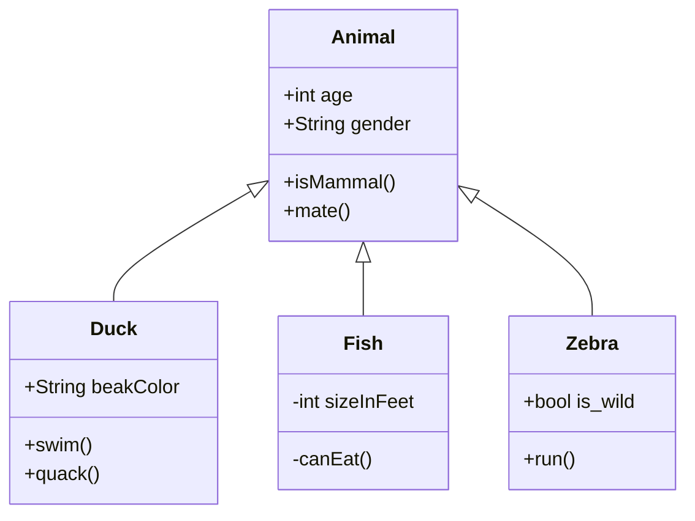

This tool allows the creation of diagrams using markdown and their own syntax. an example is shown below:



[](https://mermaid-js.github.io/mermaid-live-editor/#/edit/eyJjb2RlIjoiY2xhc3NEaWFncmFtXG4gICAgQW5pbWFsIDx8LS0gRHVja1xuICAgIEFuaW1hbCA8fC0tIEZpc2hcbiAgICBBbmltYWwgPHwtLSBaZWJyYVxuICAgIEFuaW1hbCA6ICtpbnQgYWdlXG4gICAgQW5pbWFsIDogK1N0cmluZyBnZW5kZXJcbiAgICBBbmltYWw6ICtpc01hbW1hbCgpXG4gICAgQW5pbWFsOiArbWF0ZSgpXG4gICAgY2xhc3MgRHVja3tcbiAgICAgICtTdHJpbmcgYmVha0NvbG9yXG4gICAgICArc3dpbSgpXG4gICAgICArcXVhY2soKVxuICAgIH1cbiAgICBjbGFzcyBGaXNoe1xuICAgICAgLWludCBzaXplSW5GZWV0XG4gICAgICAtY2FuRWF0KClcbiAgICB9XG4gICAgY2xhc3MgWmVicmF7XG4gICAgICArYm9vbCBpc193aWxkXG4gICAgICArcnVuKClcbiAgICB9XG4gICAgICAgICAgICAiLCJtZXJtYWlkIjp7InRoZW1lIjoiZGFyayJ9LCJ1cGRhdGVFZGl0b3IiOmZhbHNlfQ)

<!-- This is the example -->
```text
graph LR
    A --- B
    B --> C
    C --> A
    C --> B
```

More information about this tool can be found in:  

* [Live Editor](https://mermaid-js.github.io/mermaid-live-editor/)
* [Documentation](https://mermaid-js.github.io/mermaid/#/n00b-syntaxReference)
* [Github Page](https://github.com/mermaid-js/mermaid)