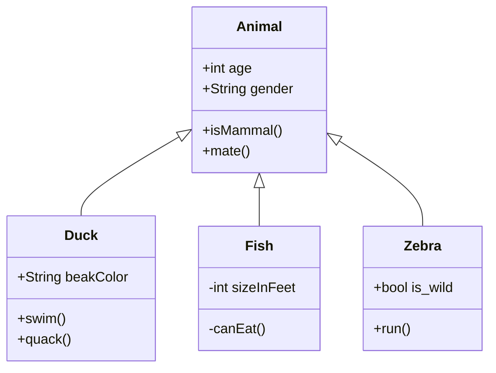

This tool allows the creation of diagrams using markdown and their own syntax. an example is shown below:



<!-- <a href="javascript: updateMermaid()" onload="myFunction()">Update</a> -->


<!-- This is the example -->
```text
classDiagram
    Animal <|-- Duck
    Animal <|-- Fish
    Animal <|-- Zebra
    Animal : +int age
    Animal : +String gender
    Animal: +isMammal()
    Animal: +mate()
    class Duck{
      +String beakColor
      +swim()
      +quack()
    }
    class Fish{
      -int sizeInFeet
      -canEat()
    }
    class Zebra{
      +bool is_wild
      +run()
    }
```

More information about this tool can be found in:  

* [Live Editor](https://mermaid-js.github.io/mermaid-live-editor/)
* [Documentation](https://mermaid-js.github.io/mermaid/#/n00b-syntaxReference)
* [Github Page](https://github.com/mermaid-js/mermaid)


