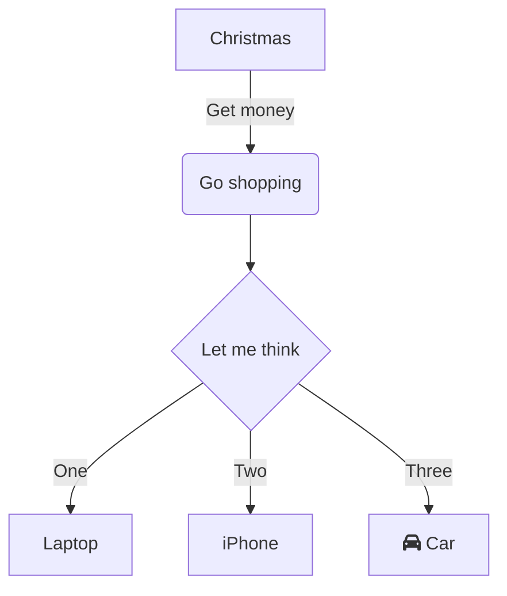

This tool allows the creation of diagrams using markdown and their own syntax. an example is shown below:





<!-- This is the example -->
```text
graph LR
    A --- B
    B --> C
    C --> A
    C --> B
```

More information about this tool can be found in:  

* [Live Editor](https://mermaid-js.github.io/mermaid-live-editor/)
* [Documentation](https://mermaid-js.github.io/mermaid/#/n00b-syntaxReference)
* [Github Page](https://github.com/mermaid-js/mermaid)